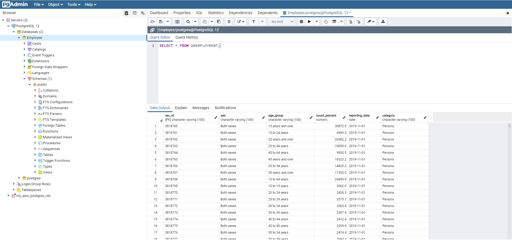
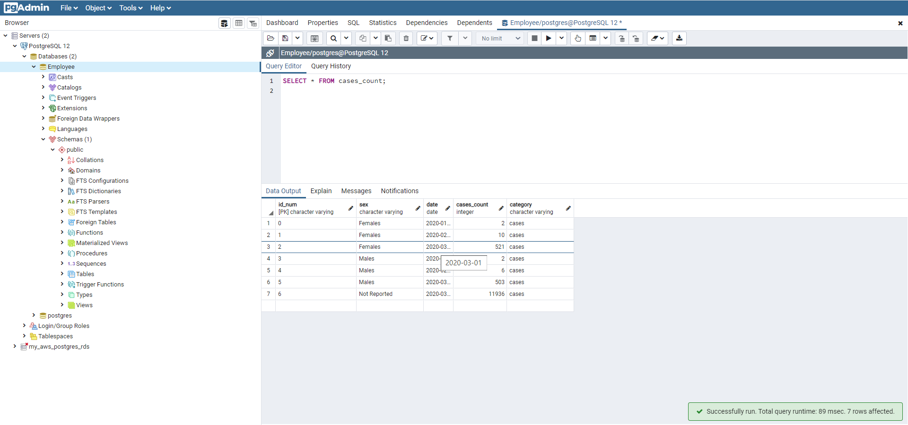
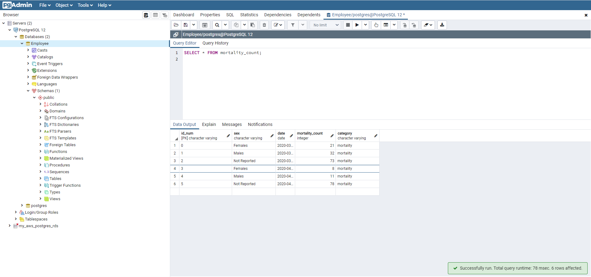
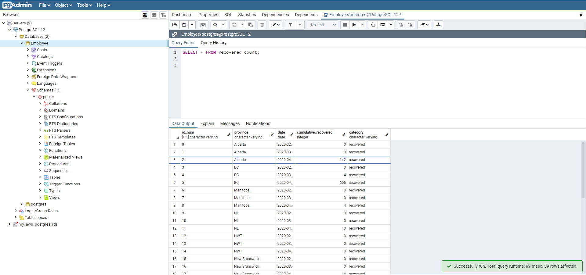
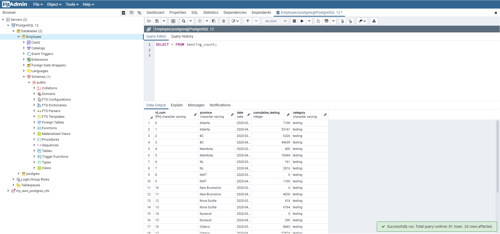
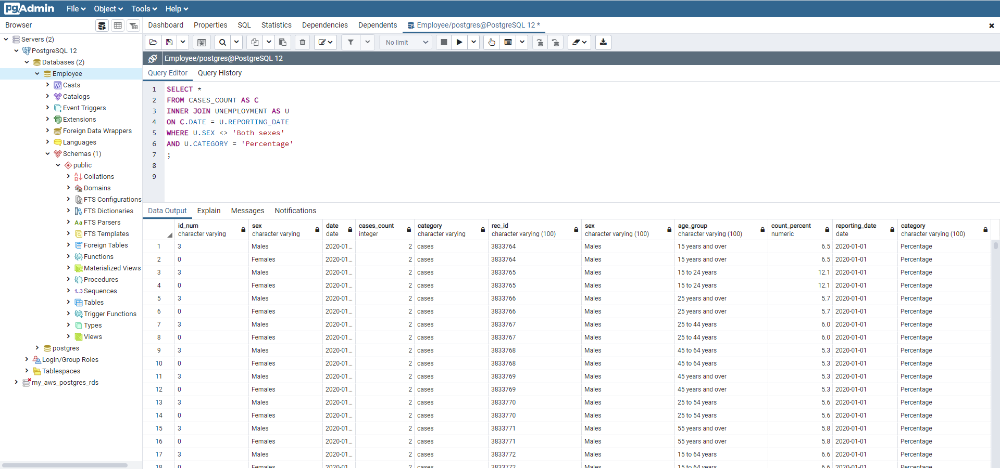

# **ETL Project: COVID-19 data in Canada**

In this assignment, the objective is to:
* Step 1: get data and transform data from the web in an automated way, by using Python/Jupyter Notebook
* Step 2: use SQL code and pgAdmin to upload the data into tables, then generate queries

  

## **1. Authors**

This project was created and authored by:
* **Latyr Thiao**
* **Stephen Zhang** [GitHub](https://github.com/stephen823)

## **2. Requirements / Specifications**

The [business & technical requirements](000-Instructions) that must be met by the solution.

## **3. Prerequisites**

The mandatory steps to be taken to make the code work smoothly.

### **3.1 License & Key**

The following key will be required:
* not applicable

### **3.2 Installing**

The assumption here is that your computer is running on Windows 10.
Feel free to adjust if you are using a Mac OS or any other operating system.

What software do you need and how to install them?

* Python, with module named pandas, psycopg2, matplotlib & config 
* Anaconda
* Jupyter Notebook
* pgAdmin 4

## **4. Tools & Coding Languages**

The following tools and coding languages were used:
* SQL
* Quick database [diagram modeling tool](https://app.quickdatabasediagrams.com/#/)
* pgAdmin 4
* Python
* Pandas
* Jupyter Notebook

## **5. Data Source(s)**

The data used as input is coming from the following sources:
* [Kaggle](https://www.kaggle.com/ryanxjhan/coronaviruscovid19-canada#cases.csv)
* [Statistics Canada](https://www150.statcan.gc.ca/t1/tbl1/en/tv.action?pid=1410001701&pickMembers%5B0%5D=1.1&pickMembers%5B1%5D=2.3)

## **6. Run the code**

### **Step 1: The code is located here**
The code is available as follows:
* Part 1: [Python/Pandas](002-Python_&_SQL_Code/001_Data_Cleaning.ipynb)
* Part 2: [SQL_Tables](002-Python_&_SQL_Code/002_Covid_Tables.sql) & [SQL_Queries](002-Python_&_SQL_Code/003_Covid_Queries.sql)

### **Step 2: Extract all files & run the code**
* Download this entire project from GitHub
* Run the [Jupyter Notebook](002-Python_&_SQL_Code/001_Data_Cleaning.ipynb) to extract data
* [Create the tables](002-Python_&_SQL_Code/002_Covid_Tables.sql) in pgAdmin
* Load data into the database [see detailed steps in this guide](000-zDocumentation/002_ETL_PROCESS_COVID_19.docx)
* [Query the tables](002-Python_&_SQL_Code/003_Covid_Queries.sql)

## **7. User Acceptance Testing**

Acceptence criteria:  
* [See instructions](000-Instructions)
* The entire process must be automated, except for the loading of data in the database
* Use of a database

## **8. Deployment**

Not applicable

## **9. Expected result**

The outcome should be similar to the below:

  

 

  

 

  

 

  

 

  

 

  

 

  

 

